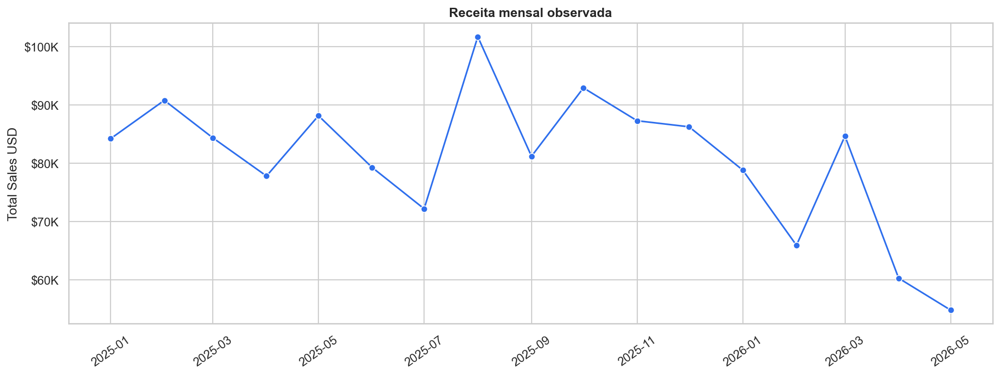
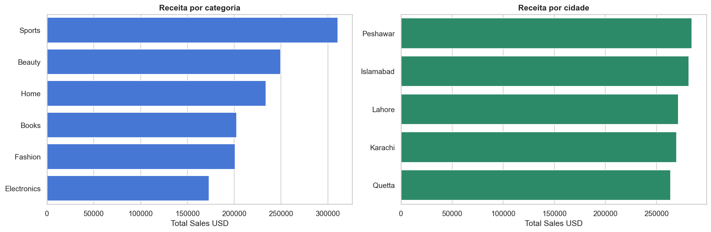
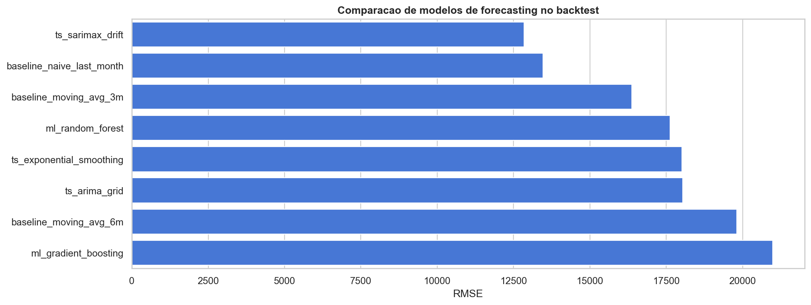
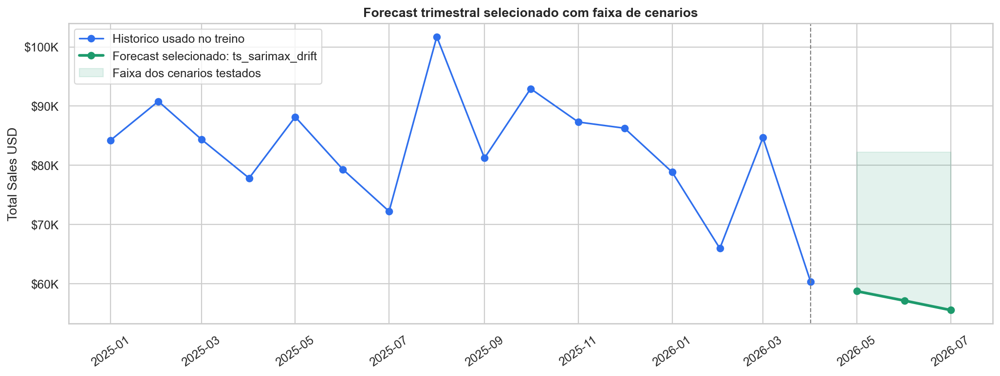
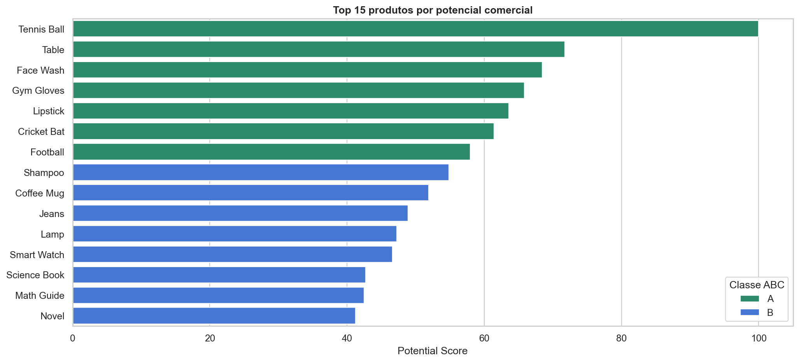
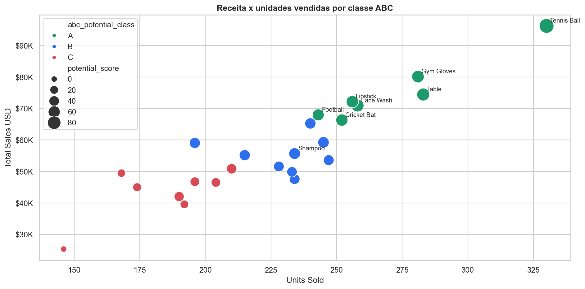

# Product Sales Analysis - Explicacao do Projeto

Este projeto foi construido para analisar vendas de produtos, criar uma camada visual de monitoramento e iniciar modelos analiticos que ajudem em previsibilidade de vendas e priorizacao de produtos.

A jornada seguiu a seguinte ordem:

1. **EDA - Analise Exploratoria de Dados**
2. **Dashboard operacional de vendas**
3. **Forecasting de receita para os proximos 3 meses**
4. **Clusterizacao e classificacao ABC de produtos**

O objetivo final e apoiar um analista de produtos com indicadores de vendas, tendencia, previsibilidade de receita e uma leitura clara de quais produtos devem receber mais atencao comercial e operacional.

---

## 1. Base de dados utilizada

A base analisada esta em:

```text
data/raw/product_sales_dataset.csv
```

Campos principais:

| Campo | Uso na analise |
|---|---|
| `Product_ID` | Identificacao do produto/transacao |
| `Product_Name` | Nome do produto |
| `Category` | Categoria comercial |
| `Price_USD` | Preco unitario |
| `Quantity_Sold` | Quantidade vendida |
| `Total_Sales_USD` | Receita total da linha |
| `Order_Date` | Data da venda |
| `Customer_City` | Cidade do cliente |

A base possui 1.000 linhas e 24 produtos distintos. A janela temporal observada vai de janeiro de 2025 ate maio de 2026.

---

## 2. EDA - Analise Exploratoria

Notebook:

```text
notebooks/01_EDA.ipynb
```

A EDA foi a primeira etapa porque antes de criar dashboard ou modelos era necessario entender:

- volume de dados;
- periodo coberto;
- qualidade dos campos;
- consistencia entre preco, quantidade e receita;
- categorias e produtos mais relevantes;
- cidades com maior receita;
- comportamento mensal das vendas;
- distribuicao de receita, preco e quantidade;
- concentracao de receita por produto.

### Receita mensal



Essa visao mostrou que a receita mensal varia bastante ao longo do tempo. Isso gerou dois direcionamentos importantes:

- o dashboard precisava mostrar tendencia e momentum;
- o projeto deveria ter uma frente de forecasting para antecipar receita futura.

### Segmentos comerciais



A analise por categoria e cidade ajudou a entender onde a receita esta concentrada. Esse tipo de corte e essencial para um analista de produtos porque permite responder perguntas como:

- quais categorias mais vendem;
- quais cidades sustentam maior receita;
- onde ha oportunidades de campanha;
- quais regioes podem exigir maior atencao de estoque.

---

## 3. Dashboard de vendas

Aplicacao:

```text
dashboard_sales_app/
```

O dashboard foi criado com:

- FastAPI;
- HTML;
- CSS;
- JavaScript.

Ele consome diretamente o dataset e entrega uma tela operacional para monitoramento das vendas.

Para rodar:

```powershell
.\.venv\Scripts\python.exe dashboard_sales_app\main.py
```

URL padrao:

```text
http://127.0.0.1:8001
```

### Indicadores implementados

O dashboard apresenta:

- receita total;
- unidades vendidas;
- numero de pedidos;
- ticket medio;
- preco medio realizado;
- produto lider;
- categoria lider;
- cidade lider;
- tendencia mensal;
- momentum de alta/baixa;
- receita por categoria;
- receita por cidade;
- ranking de produtos prioritarios;
- heatmap categoria x cidade.

### Necessidade do dashboard

A EDA e util para investigacao, mas nao e adequada para acompanhamento recorrente. O dashboard resolve esse problema ao transformar as metricas em uma interface consumivel por um analista de produtos.

Ele permite:

- acompanhar queda ou alta de vendas;
- filtrar categoria, cidade e produto;
- identificar lideres de receita;
- monitorar mudancas recentes;
- apoiar decisoes de estoque e campanhas.

Foi a partir dessa visao operacional que surgiram duas necessidades analiticas:

1. prever receita futura;
2. classificar produtos por prioridade comercial.

---

## 4. Forecasting de vendas

Notebook:

```text
notebooks/02_forecasting_total_sales.ipynb
```

O objetivo do forecasting foi prever a receita total dos proximos 3 meses. A previsao trimestral e importante para:

- planejamento de receita;
- gestao de estoque;
- acompanhamento de metas;
- antecipacao de queda ou crescimento;
- suporte a decisoes comerciais.

### Tratamento de meses incompletos

Um ponto importante foi remover meses incompletos do treino. A base possui dados em maio de 2026, mas o mes nao esta completo. Se esse mes fosse usado como historico fechado, o modelo poderia interpretar uma queda artificial.

Por isso:

- ultimo mes completo usado no treino: abril de 2026;
- primeiro mes previsto: maio de 2026;
- horizonte previsto: maio, junho e julho de 2026.

### Modelos testados

Foram comparadas varias abordagens:

- baseline naive;
- media movel de 3 meses;
- media movel de 6 meses;
- Exponential Smoothing;
- ARIMA via grid search;
- ARIMA/SARIMAX com drift;
- Random Forest Regressor;
- Gradient Boosting Regressor.

### Comparacao de modelos



O resultado mostrou que modelos mais sofisticados de ML nao necessariamente performam melhor quando ha pouco historico mensal. Como a serie mensal possui poucos pontos, modelos estatisticos simples foram mais competitivos.

O modelo campeao no backtest foi o ARIMA/SARIMAX com drift.

### Forecast selecionado



O grafico mostra:

- historico usado no treino;
- forecast selecionado;
- faixa dos cenarios testados;
- ponto de corte entre historico e previsao.

Essa abordagem e mais defensavel porque nao apresenta apenas uma linha isolada. Ela mostra tambem a incerteza entre cenarios candidatos.

### Recorrencia da previsao

Foram considerados dois tipos de previsao:

- **recursiva explicita**: usada em baselines e ML. A previsao do mes 1 entra no historico para prever o mes 2, e mes 1 + mes 2 entram para prever o mes 3.
- **multi-step interna**: usada em ARIMA/ETS via `forecast(3)`. O proprio modelo propaga o estado previsto para os proximos passos, sem usar valores reais futuros.

---

## 5. Clusterizacao e ABC de produtos

Notebook:

```text
notebooks/03_clusterizacao_produtos_abc.ipynb
```

A clusterizacao foi criada para responder:

> Quais produtos sao mais importantes para priorizacao comercial, gestao de estoque e recomendacao?

Enquanto o forecasting olha para previsibilidade de receita, a clusterizacao olha para priorizacao de produtos.

### Features avaliadas

Foram criadas features por produto, incluindo:

- receita total;
- unidades vendidas;
- numero de pedidos;
- preco medio;
- ticket medio;
- cidades atendidas;
- meses ativos;
- crescimento recente;
- volatilidade da demanda;
- recencia da ultima venda.

### Top produtos por potencial



O ranking por potencial comercial combina varias dimensoes. Isso evita que a decisao seja baseada apenas em receita historica.

### Receita x unidades por classe ABC



Essa visao ajuda a diferenciar:

- produtos grandes em receita;
- produtos fortes em volume;
- produtos com potencial intermediario;
- produtos de menor prioridade relativa.

---

## 6. O que significam as classes ABC

O notebook gera tres classes diferentes, cada uma com uma funcao.

### `abc_revenue_class`

Classe ABC tradicional baseada somente em receita historica.

Ela responde:

> Quais produtos mais contribuiram para a receita total ate agora?

Tecnica:

- ordenacao por receita;
- calculo de share;
- calculo de receita acumulada;
- regra de Pareto:
  - A ate aproximadamente 80%;
  - B ate aproximadamente 95%;
  - C acima disso.

### `abc_cluster_class`

Classe derivada do K-Means.

Ela responde:

> Com qual grupo de comportamento esse produto se parece?

Modelo:

```text
KMeans(n_clusters=3)
```

Features usadas:

- receita;
- unidades;
- pedidos;
- preco medio;
- ticket medio;
- cidades;
- meses ativos;
- crescimento recente;
- volatilidade;
- recencia.

Depois os clusters sao ordenados pelo score medio de potencial:

- maior score medio: A;
- intermediario: B;
- menor: C.

### `abc_potential_class`

Essa e a classe final recomendada para negocio.

Ela responde:

> Qual e a prioridade comercial final do produto?

Base:

```text
potential_score
```

Composicao:

- 40% receita;
- 25% unidades;
- 15% pedidos;
- 10% cidades;
- 10% crescimento recente;
- penalidade por volatilidade.

Regra final:

- top 30% dos produtos por potencial: A;
- proximos 40%: B;
- ultimos 30%: C.

Portanto, a classe final usada no dashboard e nas decisoes deve ser:

```text
abc_potential_class
```

As outras classes sao auxiliares para interpretacao.

---

## 7. Como as etapas se conectam

O fluxo completo do projeto pode ser resumido assim:

```text
EDA
  -> entende comportamento, qualidade e concentracao das vendas

Dashboard
  -> transforma a analise em monitoramento operacional

Forecasting
  -> antecipa receita dos proximos meses

Clusterizacao ABC
  -> identifica produtos prioritarios para estoque, campanha e recomendacao
```

A EDA mostrou padroes e variacoes nas vendas. O dashboard transformou esses achados em KPIs e graficos para acompanhamento. O forecasting nasceu da necessidade de prever o rumo das vendas. A clusterizacao nasceu da necessidade de entender quais produtos merecem maior foco operacional e comercial.

---

## 8. Estrutura principal do projeto

```text
Product_sales_analysis/
|
|-- data/
|   `-- raw/
|       `-- product_sales_dataset.csv
|
|-- notebooks/
|   |-- 01_EDA.ipynb
|   |-- 02_forecasting_total_sales.ipynb
|   `-- 03_clusterizacao_produtos_abc.ipynb
|
|-- dashboard_sales_app/
|   |-- main.py
|   |-- templates/
|   |   `-- index.html
|   `-- static/
|       |-- styles.css
|       `-- app.js
|
|-- docs/
|   `-- assets/
|       |-- eda_monthly_sales.png
|       |-- eda_segments.png
|       |-- forecast_model_comparison.png
|       |-- forecast_selected.png
|       |-- cluster_top_products.png
|       `-- cluster_revenue_units.png
|
|-- scripts/
|   `-- generate_readme_assets.py
|
|-- requirements.txt
`-- readme_explanation.md
```

---

## 9. Proximos passos recomendados

Melhorias naturais:

- integrar forecast e classe ABC diretamente no dashboard;
- criar forecast por categoria e por produto;
- criar alertas de queda brusca de vendas;
- criar sugestao de estoque minimo com base em demanda prevista;
- criar classificacao de risco de ruptura;
- enriquecer a base com margem, estoque atual, lead time e identificador de cliente;
- criar um sistema de recomendacao por cidade/categoria/produto.

Com esses proximos passos, o projeto deixa de ser apenas analitico e passa a caminhar para uma ferramenta de decisao comercial e operacional.
